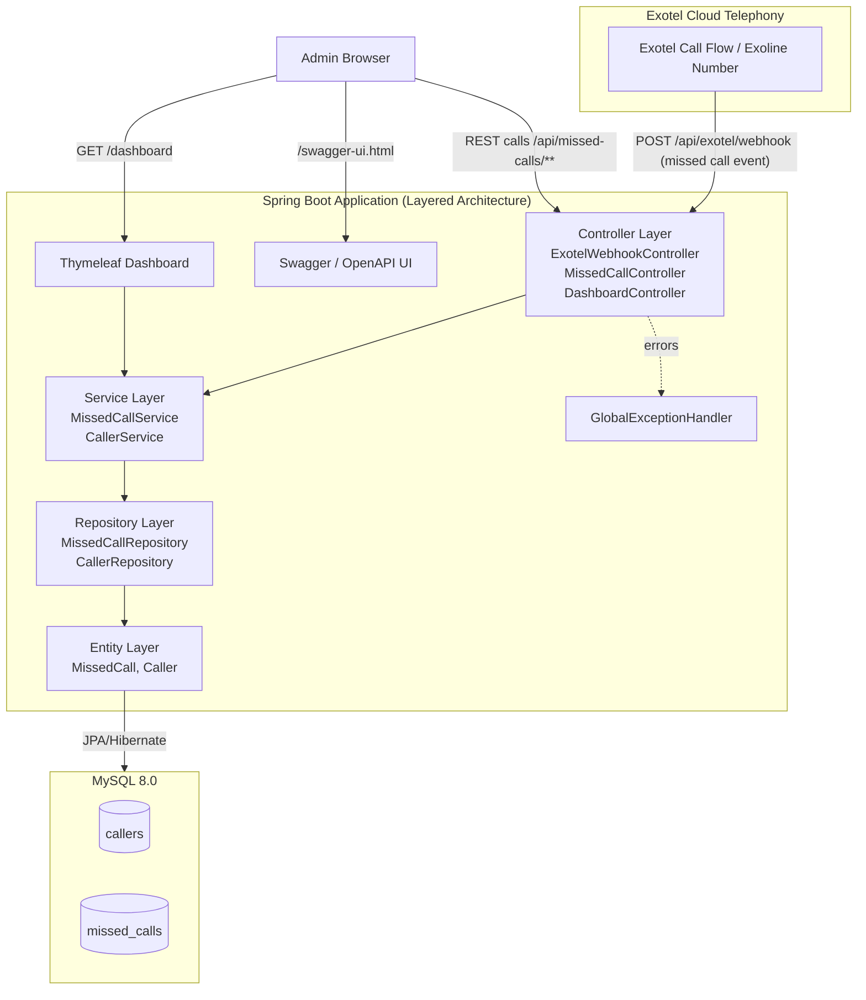
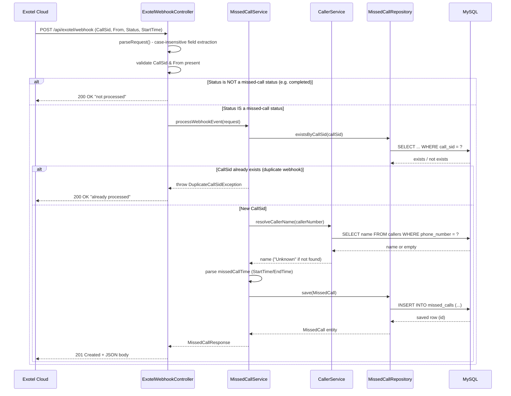
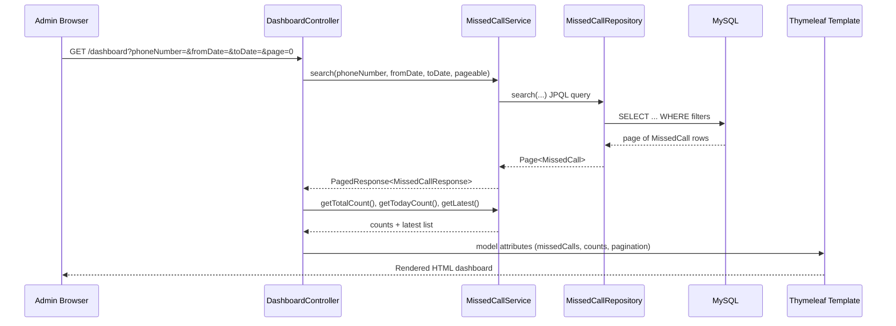

# System Architecture & Sequence Diagrams

## 1. System Architecture Diagram

**Layer responsibilities:**
- **Controller Layer** — HTTP entry points; request parsing, response shaping, no business logic.
- **Service Layer** — Business rules: idempotency (duplicate CallSid check), caller-name resolution, status filtering, date range logic.
- **Repository Layer** — Spring Data JPA interfaces; query derivation and custom JPQL.
- **Entity Layer** — JPA-mapped domain objects (`MissedCall`, `Caller`) persisted to MySQL.
- **Exception Layer** — Centralized `@RestControllerAdvice` translating exceptions to consistent JSON error responses.

---

## 2. Sequence Diagram — Missed Call Webhook Processing

---

## 3. Sequence Diagram — Dashboard View Request

---

## 4. Call Flow Explanation

1. A call lands on the Exotel Exoline/virtual number and is routed through the configured Exotel App Bazaar flow.
2. If the call is **not answered, busy, fails, or is canceled**, Exotel's call-status callback (or Passthru applet) fires a webhook to this application's `/api/exotel/webhook` endpoint with the call's metadata.
3. The webhook controller extracts `CallSid`, `From`, `Status`, and `StartTime`/`EndTime` from the form payload.
4. If the status is not one of the "missed" types (e.g., it was actually answered), the event is acknowledged but discarded.
5. The service layer checks `call_sid` uniqueness to prevent duplicate inserts from Exotel's automatic webhook retries.
6. The caller's phone number is looked up in the `callers` table; if found, the registered name is attached, otherwise `"Unknown"` is stored.
7. The missed call record is persisted to MySQL.
8. The data is immediately queryable via REST APIs and visible on the live dashboard.
